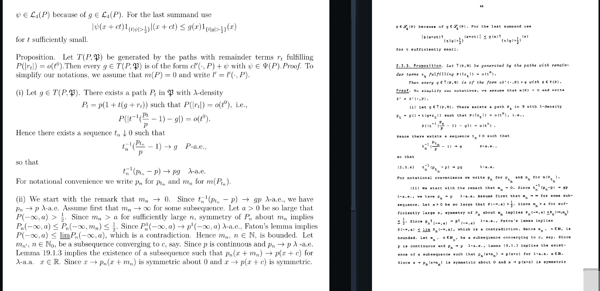

# `llm-ocr-tex`: convert old books/papers into LaTeX

Pfanzagl (1982) is a classic text in semiparametric statistics but is difficult to read due to its archaic typesetting. This repo processes the text using OCR (via gemini 2.0) and converts it into latex, which can then be post-processed into a reasonable output format.

This can be adapted to OCR and typeset your own old books/papers. The process is as follows:

1. Scan the text using a high-resolution scanner (300 dpi or higher), preferably in grayscale, output to pdf.
2. Use `0_extract.py` to convert the pdf into images (this populates the `pdf_images` directory).
3. Use `1_ocr.py` to run OCR on the images (this populates the `raw_tex` directory).
4. Tinker with the output in `raw_tex` to get the text into a readable format. This is the most time-consuming part of the process, but is hard to automate. An example of a successful output is

